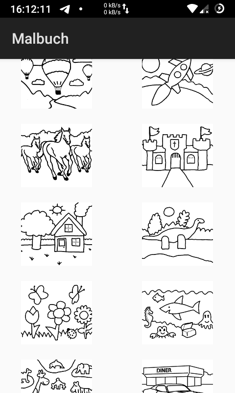
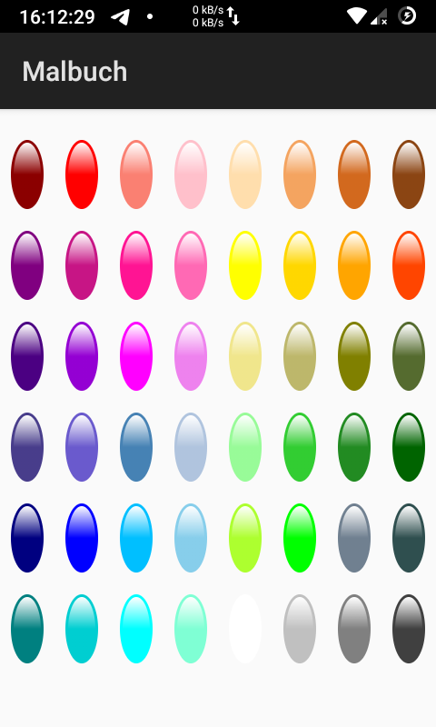
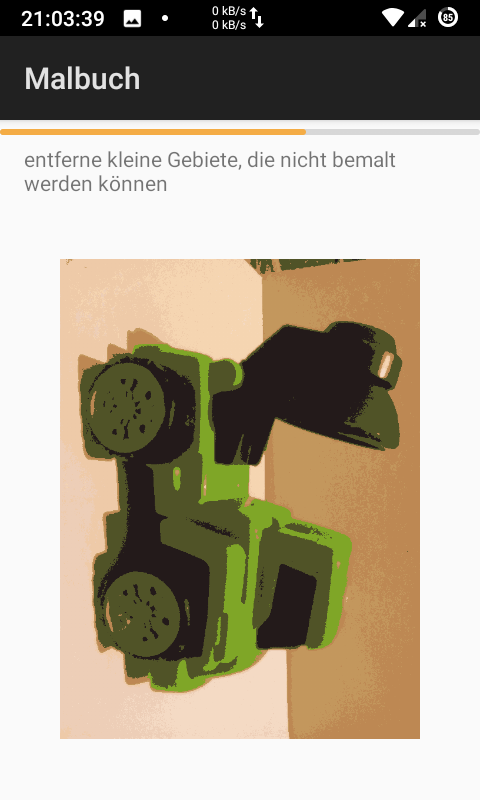
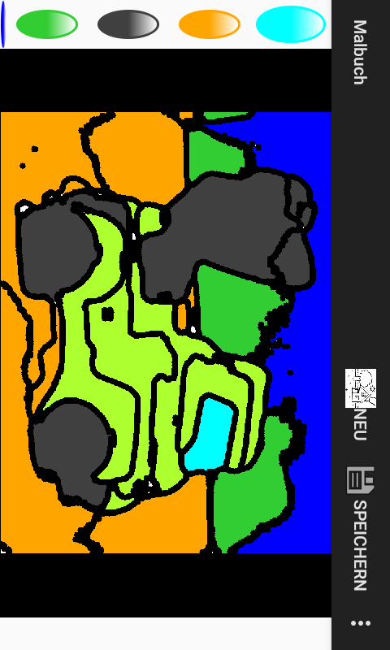

# Coloring Book

   

## Development

This app is developed using Android Studio.

You are welcome to contribute!
- Translate the app - [read the Documentation]
- Add features, see HowTo.
- Solve [issues].

If so and you need help, do not hesitate to open an [issue][issues] to ask!

## How To

**Add more pictures to paint**:

1. Open Android Studio
2. Click right on `res` > `drawable`
3. Click right > `New` > `Image Asset`
4. Make sure to name your image asset starting with `outline` followed by the
    number, underscore and name.
    Also, we do need PNG images of size 600x480, so the app stays small.

**Translate the app**: Go to [Transifex] and [read the Documentation].

## License

This software is open-source under the [GPLv3](LICENSE).

## Credits

- see the app's credits/about page
- [androidsoft-lib-utils](https://github.com/niccokunzmann/androidsoft-lib-utils)
- [comic clustering](https://github.com/niccokunzmann/comic-cluster)

## Related:
- [coloring-book-gallery](https://github.com/niccokunzmann/coloring-book-gallery)
- [coloringbook-lib-utils](https://github.com/niccokunzmann/coloringbook-lib-utils)
- [androidsoft-lib-credits](https://github.com/androidsoft-org/androidsoft-lib-credits/)

[issues]: https://github.com/niccokunzmann/androidsoft-coloring/issues
[Transifex]: https://www.transifex.com/mundraub-android/coloring-book/dashboard/
[read the Documentation]: documentation/README.md#readme

